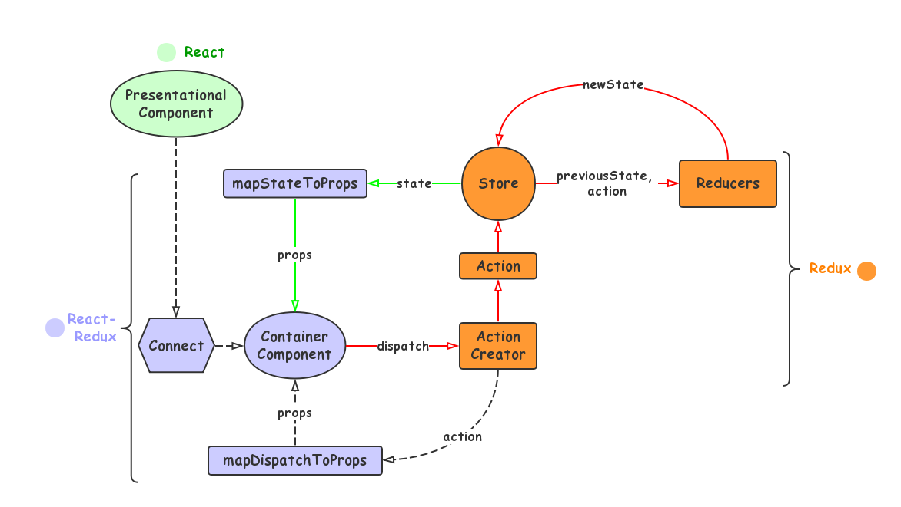
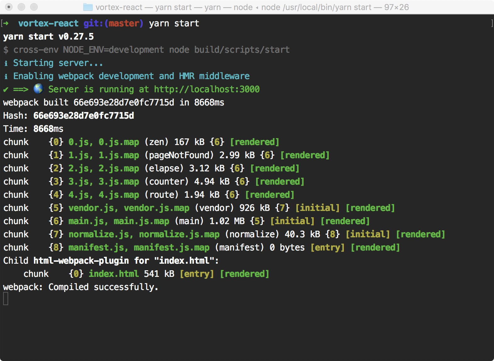
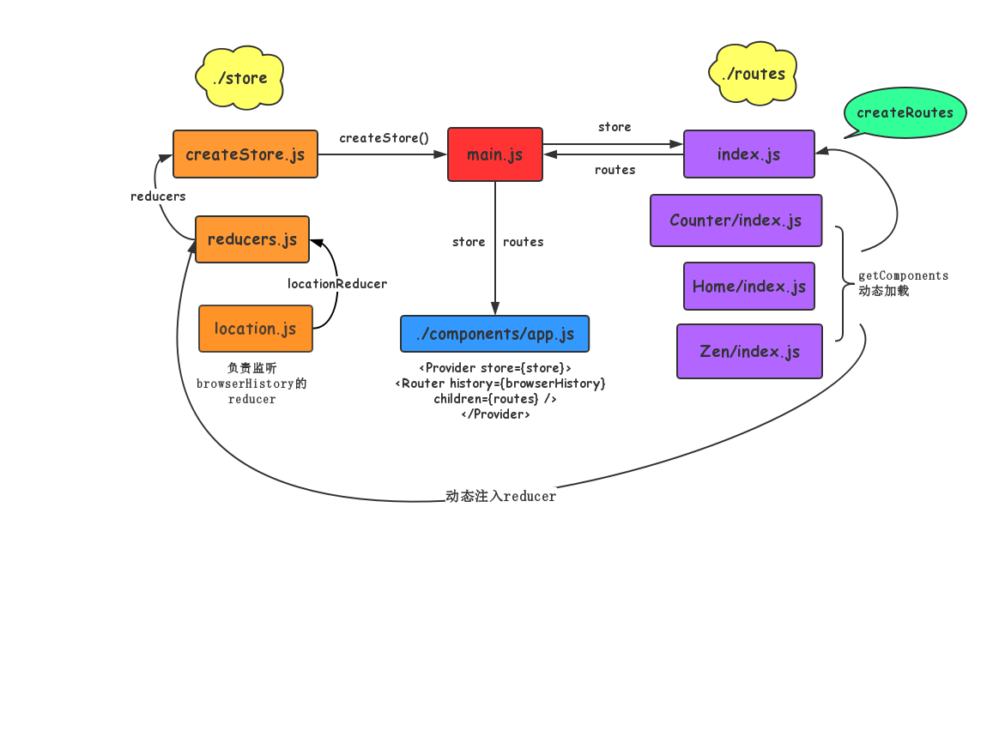
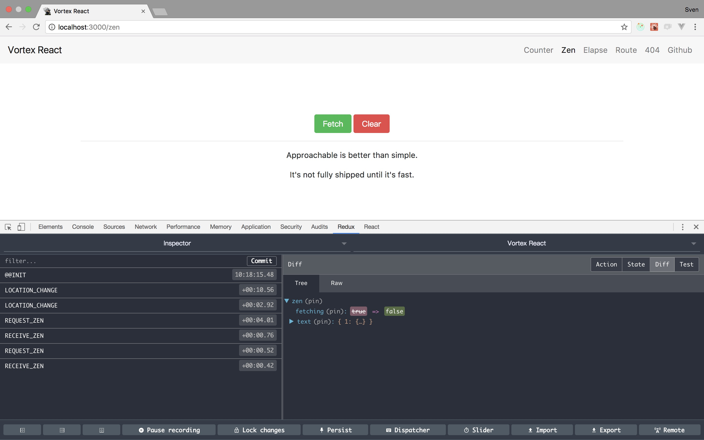

# vortex-react

[](https://travis-ci.org/YutHelloWorld/vortex-react)

基于[React](https://facebook.github.io/react/)、[Redux](http://redux.js.org/)、[React-Router@3.x](https://github.com/ReactTraining/react-router/tree/v3/docs)、[webpack](https://webpack.js.org/)和[reactstrap](https://reactstrap.github.io/)的前端脚手架。

## 目录

- [前言](#前言)
- [特性](#特性)
- [环境](#环境)
- [开始](#开始)
- [工程结构](#工程结构)
- [开发调试](#开发调试)
- [单元测试](#单元测试)
- [静态部署](#静态部署)
- [相关文档](#相关文档)
- [致谢](#致谢)

## 前言

如果你是一个Reat初学者，这个项目可以是很好的教程。如果你在计划使用React技术栈创建一个大型SPA，那么这个项目正好适合你。如果这个项目对你有帮助，请不吝啬的给于star或者watch支持。

## 特性

- [ES2015](https://babeljs.io/learn-es2015/)
- [Webpack](https://webpack.js.org/)
- [Redux](http://redux.js.org/)
- [React-router](https://github.com/ReactTraining/react-router/tree/v3/docs)
- [reactstrap](https://reactstrap.github.io/)
- [Eslint](http://eslint.cn/)
- [Express](http://expressjs.com/)
- [Babel](https://babeljs.io/)
- [Karma](https://karma-runner.github.io/1.0/index.html)

### 数据流



## 环境

- node `^5.0.0`
- yarn `^0.23.0` or npm `^3.0.0`

## 开始

在确认你的开发环境是以上[环境配置](#环境)，就开始可以基于这个脚手架创建你的应用了:

首先，克隆这个工程。

```bash
$ git clone https://github.com/yuthelloworld/vortex-react.git <my-project-name>
$ cd <my-project-name>
```

然后，安装工程依赖。推荐使用[cnpm](https://npm.taobao.org/)或[Yarn](https://yarnpkg.com/)，这样可以节约你安装依赖的所需的时间，避免出现一些莫名奇妙的错误。

```bash
$ yarn  # Install project dependencies (or `npm install` or `cnpm install`)
```

最后，使用命令`yarn start`或者`npm start`来启动该应用。

```bash
$ yarn start  # Start the development server (or `npm start`)
```


这里还有一些其他的处理命令:

|`yarn <script>`    |描述|
|-------------------|-----------|
|`start`            |启动并热更新 http://localhost:3000|
|`build`            |构建到目录 ./dist|
|`test`             |通过Karma执行单元测试|
|`test:watch`       |代码改变时通过监控模式重新执行单元测试|
|`lint`             |代码检查|
|`lint:fix`         |代码检查并修复|

## 工程结构


```
.
├── build                    # 打包配置
├── public                   # 公共静态资源
├── server                   # express服务
│   └── main.js              # 服务入口js
├── src                      # 应用源文件
│   ├── index.html           # html模板
│   ├── main.js              # 程序启动和渲染
│   ├── normalize.js         # 浏览器的兼容和垫片
│   ├── components           # 全局可复用组件
│   ├── layouts              # 主页布局
│   │   └── PageLayout       # 导航
│   ├── routes               # 动态路由
│   │   ├── index.js         # 主路由
│   │   ├── Home             # 子路由Home
│   │   │   ├── index.js     # 路由定义和异步加载
│   │   │   ├── assets       # 组件的静态文件
│   │   │   ├── components   # 展示组件
│   │   │   └── routes **    # 子路由
│   │   └── Counter          # 子路由Couner
│   │       ├── index.js     # 路由定义
│   │       ├── container    # 容器组件
│   │       ├── modules      # module(reducers/constants/actions)
│   │       └── routes **    # 子路由
│   ├── store                # Redux相关模块
│   │   ├── createStore.js   # 创建和使用redux store
│   │   └── reducers.js      # Reducer的注册和注入
│   └── styles               # 样式表
└── tests                    # 单元测试
```
## 开发调试

在开发环境，采用了web-dev-middleware和web-hot-middleware。代码实时热更新。

### Redux DevTools

强烈推荐安装谷歌浏览器插件[Redux DevTools Chrome Extension](https://chrome.google.com/webstore/detail/redux-devtools/lmhkpmbekcpmknklioeibfkpmmfibljd),来查看整个应用的状态时光穿梭。


### 路由
我们使用`React-router`的[plainRoute](https://github.com/ReactTraining/react-router/blob/v3/docs/API.md#plainroute)来定义应用的逻辑单元。[更多](#工程结构)

## 单元测试
新增一个单元测试，你只需在`./tests`中创建`.spec.js`文件。

## 静态部署

如果你通过`nginx` web 服务来启动应用，请确保路由指向`~/dist/index.html`，然后让react-router处理剩下的事，更多参考[这个文档](https://github.com/ReactTraining/react-router/blob/v3/docs/guides/Histories.md#configuring-your-server)。Express在脚手架中用于扩展服务和代理API。

## 相关文档
[React知识地图](https://github.com/YutHelloWorld/Blog/issues/1)

## 致谢
欢迎给这个项目提[PR](https://github.com/YutHelloWorld/vortex-react/pulls)或者[issues](https://github.com/YutHelloWorld/vortex-react/issues),谢谢！
