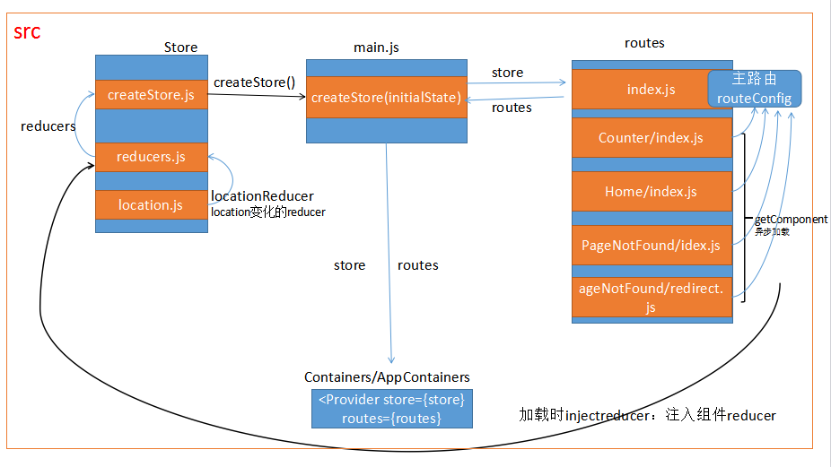

# vortex-react

基于[React](https://facebook.github.io/react/)、[Redux](http://redux.js.org/)、[React-Router@3.x](https://github.com/ReactTraining/react-router/tree/v3/docs)和[ant-desgin-UI](https://ant.design/index-cn)的前端脚手架。

## 特性

- 支持HMR
- 动态路由，配合webpack，按需加载
- 代码检查
- 单元测试



## 开始之前
* 确保 node `^5.0.0`
* yarn `^0.23.0` or npm `^3.0.0`
* 用[cnpm](https://npm.taobao.org/)或[Yarn](https://yarnpkg.com/)能节约你安装依赖的时间

## 安装

在终端执行以下命令，clone这个仓库。

```bash
$ git clone https://github.com/yuthelloworld/vortex-react.git <my-project-name>
$ cd <my-project-name>
```

安装所有依赖

```bash
$ yarn  # Install project dependencies (or `npm install` or `cnpm install`)
```

## 启动

通过`yarn start`或者`npm start`来启动该应用。

```bash
$ yarn start  # Start the development server (or `npm start`)
```
其他的处理命令:

|`yarn <script>`    |描述|
|-------------------|-----------|
|`start`            |启动并热更新 http://localhost:3000|
|`build`            |构建到目录 ./dist|
|`test`             |通过Karma执行单元测试|
|`test:watch`       |代码改变时通过监控模式重新执行单元测试|
|`lint`             |代码检查|
|`lint:fix`         |代码检查并修复|

## 目录结构


```
.
├── build                    # 构建相关配置代码
├── public                   # 公共静态文件
├── server                   # express服务
│   └── main.js              # 服务入口
├── src                      # 前端代码目录
│   ├── index.html           # 应用的html容器
│   ├── main.js              # 应用入口JS
│   ├── normalize.js         # 浏览器的适配
│   ├── components           # 应用根组件
│   ├── layouts              # 主页结构的组件
│   │   └── PageLayout       # 路由公共导航
│   ├── routes               # 路由和异步加载
│   │   ├── index.js         # 工程主路由
│   │   ├── Home             # 子路由
│   │   │   ├── index.js     # 路由定义和异步代码分割
│   │   │   ├── assets       # 组件的静态文件
│   │   │   ├── components   # 展示组件
│   │   │   └── routes **    # 子路由
│   │   └── Counter          # 子路由
│   │       ├── index.js     # 路由定义
│   │       ├── container    # 容器组件
│   │       ├── modules      # module层（reducers/constants/actions）
│   │       └── routes **    # 子路由
│   ├── store                # Redux相关模块
│   │   ├── createStore.js   # 创建和使用redux store
│   │   └── reducers.js      # Reducer的注册和注入
│   └── styles               # 样式表
└── tests                    # 单元测试
```

